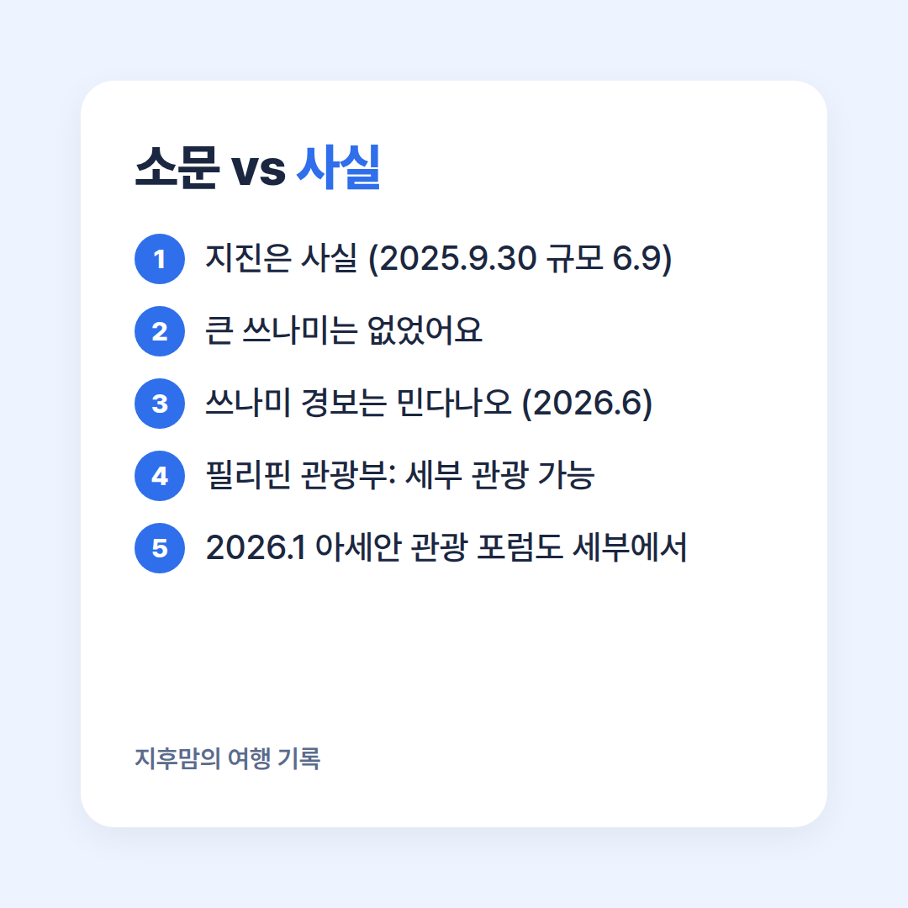
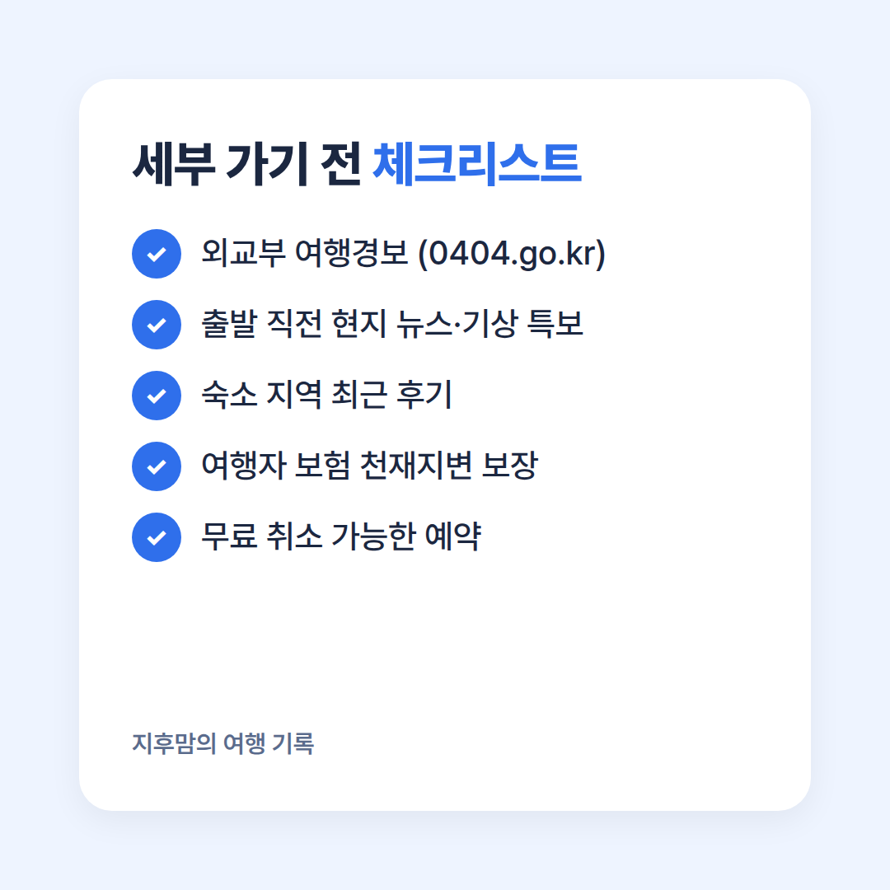

"세부? 지금 **절대 가지마세요.** 지진 나서 난리래요."

요즘 세부 여행을 알아보다 보면 이런 말, 한 번쯤 들어보셨죠?
한때 **한국인이 가장 많이 찾던 동남아 여행지**였던 세부, 정말 지금은 갈 수 없는 곳이 된 걸까요?

소문만 믿고 여행을 접기 전에, **공식 발표와 기사로 지금 상황을 직접 확인**해 봤어요.

## 세부에 무슨 일이 있었나

**2025년 9월 30일 밤**, 세부 북부 앞바다에서 **규모 6.9 지진**이 발생했어요.
세부 북부에서 관측된 지진 중 가장 강했고, 79명이 목숨을 잃는 큰 피해가 있었어요.

같은 해 가을에는 강한 태풍 피해까지 겹치면서, 세부 호텔들은 **2026년 초까지 예약 취소**가 이어졌다고 해요.
"세부 가지 마라"는 이야기가 퍼진 것도 이때부터였어요.

<!-- 📷 직접 사진: 예전에 다녀온 세부 바다·리조트 사진 (재난 현장 사진은 쓰지 마세요) -->

## 쓰나미 때문에 못 간다? 반전은 이거예요

많이 알려진 것과 달리, 2025년 세부 지진 때 **큰 쓰나미는 발생하지 않았어요.**
"쓰나미 경보"로 크게 기사가 났던 건 **2026년 6월 민다나오 지진**인데, 민다나오는 세부와 다른 섬이에요.

그리고 필리핀 관광부(DOT)는 **"세부는 관광객에게 열려 있다"**고 공식 발표했어요.
2026년 1월에는 동남아 관광장관들이 모이는 **아세안 관광 포럼(ATF 2026)**이 바로 세부에서 열리기도 했고요.

## 그래도 이런 분들은 신중하세요

"절대 못 간다"는 사실이 아니지만, **아무 준비 없이 가도 된다**는 뜻도 아니에요.

- **진앙 근처 세부 북부 지역**(보고시 등)은 복구 상황을 꼭 확인하세요.
- 필리핀은 지진·태풍이 잦은 나라예요. **태풍 시즌**에는 일정 변경 가능성을 염두에 두세요.
- 아이와 함께라면 숙소 주변 병원, 비상 연락처를 미리 챙겨 두면 마음이 편해요.

<!-- ✍️ 직접 쓰기: 예전에 세부 갔을 때 좋았던 점 / 다시 간다면 가고 싶은 이유 한두 줄 -->

## 세부 여행 전 체크리스트

1. **외교부 해외안전여행 사이트**(0404.go.kr)에서 필리핀 여행경보 확인
2. 출발 직전 **현지 뉴스·기상 특보** 확인
3. 숙소가 있는 지역(막탄, 세부시티 등)의 **최근 후기** 확인
4. **여행자 보험**에 천재지변 보장이 있는지 확인
5. 항공·숙소는 **무료 취소 가능한 옵션**으로

## 정리

- 세부 지진은 사실이지만, **"지금 절대 못 간다"는 소문은 사실이 아니에요**
- 쓰나미 경보는 세부가 아닌 **민다나오** 이야기였어요
- 대신 **여행경보 · 지역 상황 · 보험** 세 가지는 꼭 확인하고 떠나세요

여러분은 세부 여행, **지금 가실 건가요, 조금 더 기다리실 건가요?**
댓글로 의견 남겨주세요 😊

<!-- ✍️ 발행 직전 확인: 0404.go.kr 필리핀 여행경보와 최신 뉴스를 한 번 더 보고, 달라진 게 있으면 알려주세요 -->
