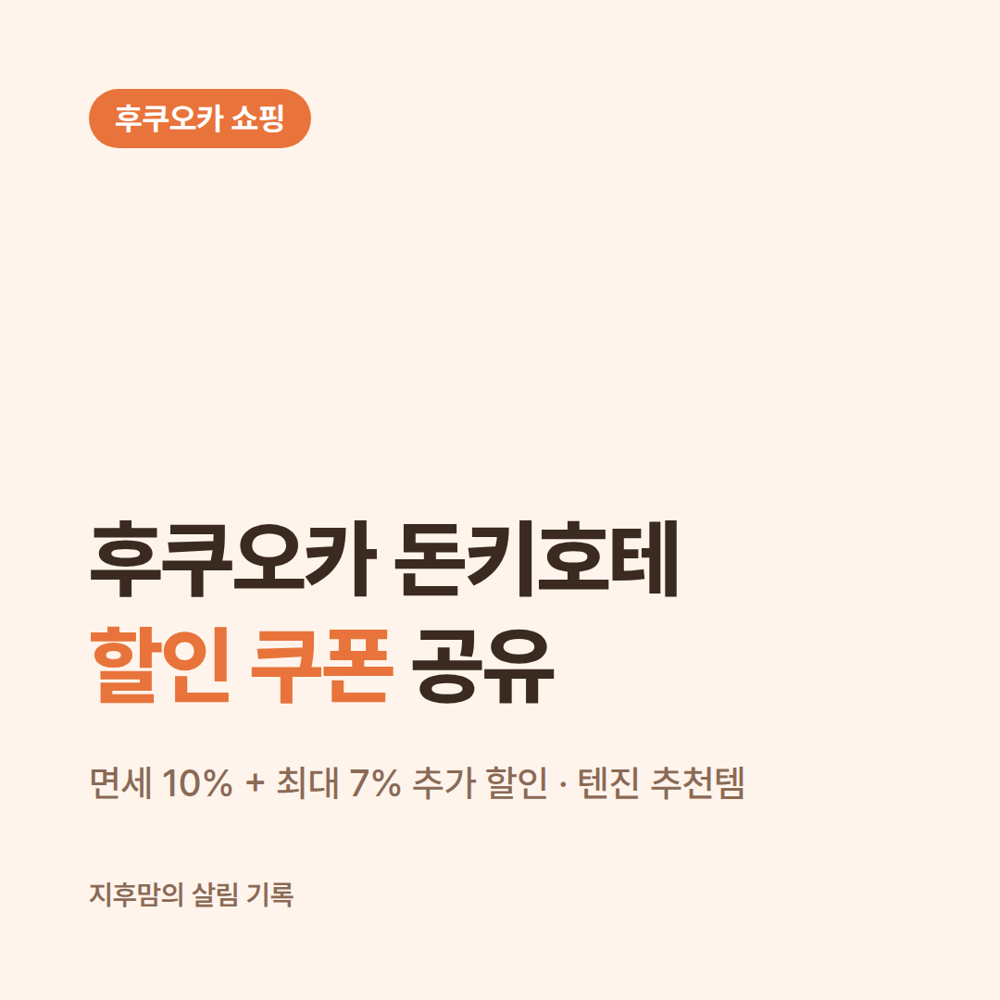
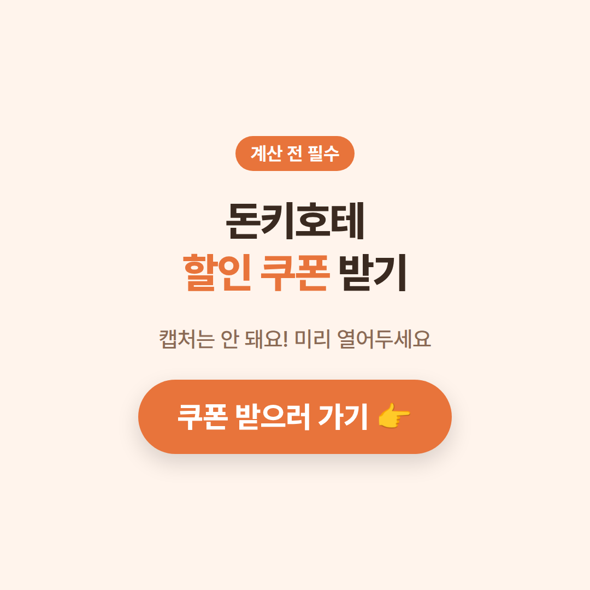
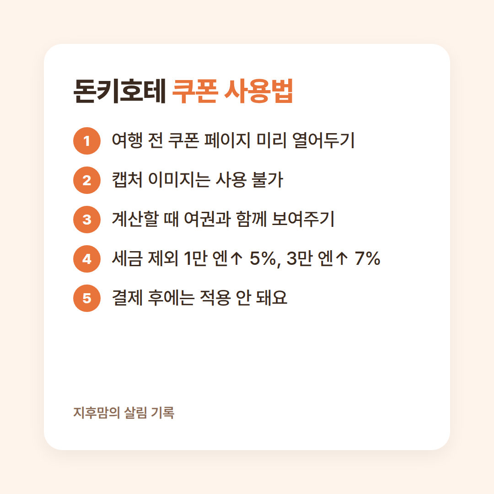
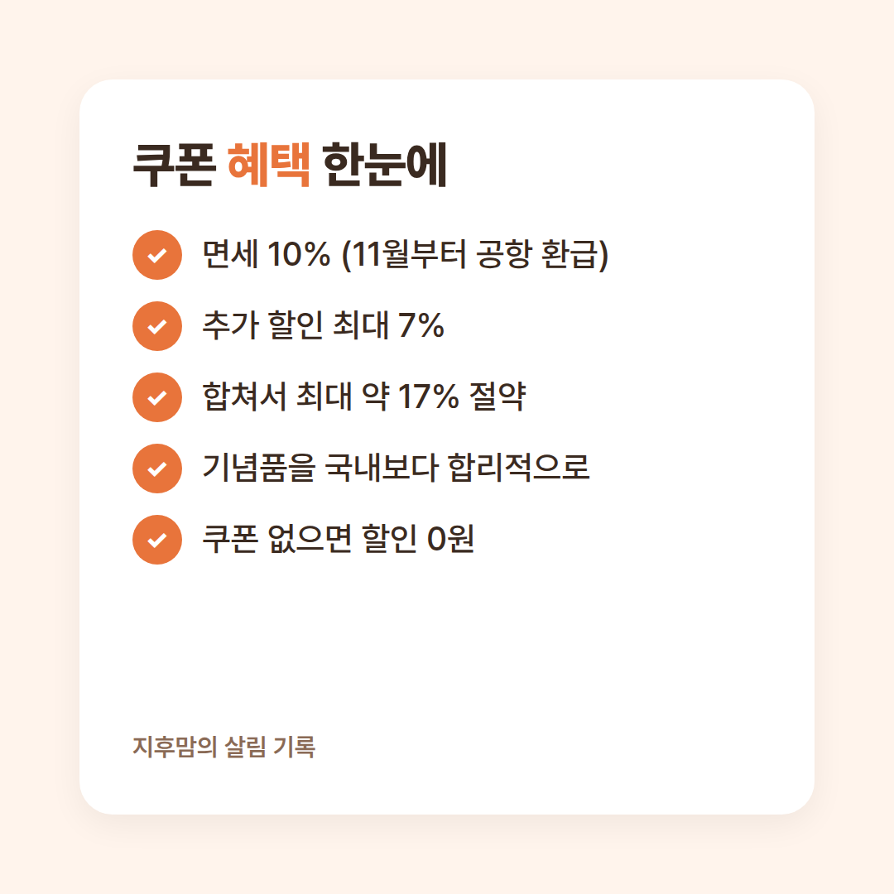
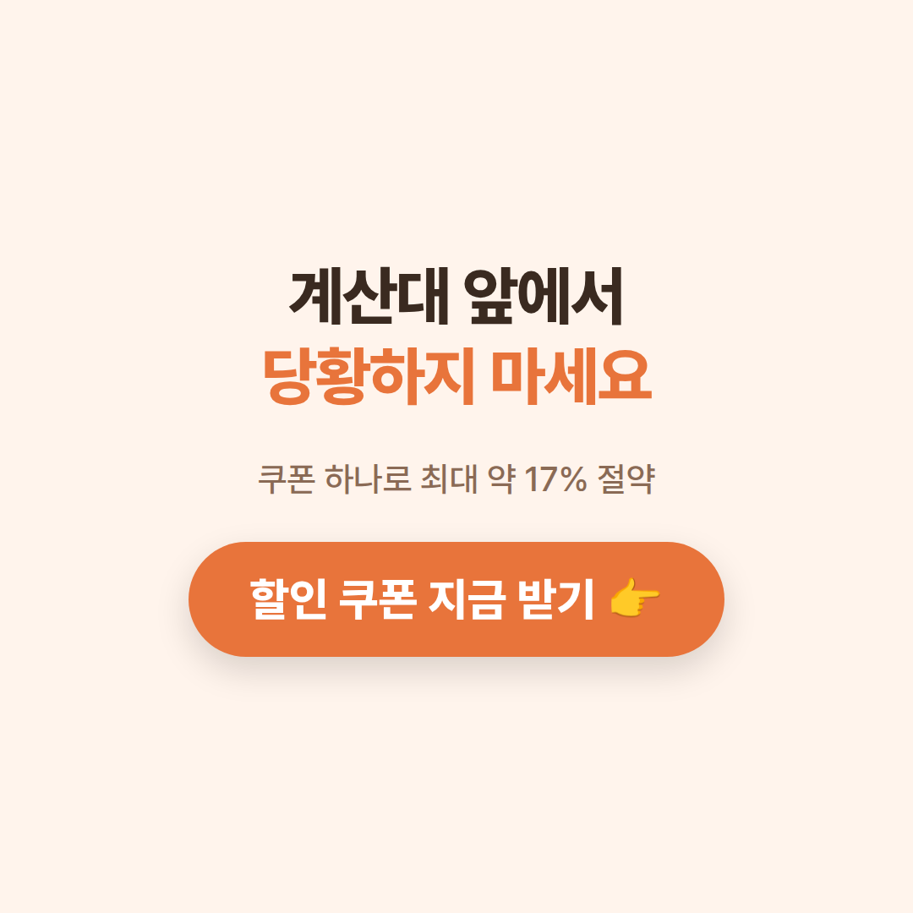

<!-- 광고 표기 (필수, 지우지 마세요) -->
**이 포스팅은 제휴 마케팅 활동의 일환으로, 판매 발생 시 수수료를 제공받습니다.**

후쿠오카 여행 가면 **돈키호테**는 꼭 들르게 되잖아요.
그런데 계산대 앞에서 다들 휴대폰으로 뭔가를 보여주고 있는 거 보셨나요? 바로 **돈키호테 할인 쿠폰**이에요.

저는 이걸 모르고 갔다가 제대로 낭패를 봤었어요. 😭
쿠폰 하나 차이로 **면세 10% + 추가 할인 최대 7%**, 합쳐서 최대 약 **17%**까지 아낄 수 있는데 말이죠.

그래서 이번 글에서는 **후쿠오카 돈키호테 할인 쿠폰** 받는 법부터, 텐진점에서 사면 좋은 쇼핑리스트까지 한 번에 정리해 드릴게요.

👉 **[돈키호테 할인 쿠폰 먼저 받아두기](https://myrealt.rip/OVSx88)**
(계산할 때 바로 보여줘야 해서, 여행 전에 미리 열어두는 게 편해요)

<!-- 📷 직접 사진: 텐진 돈키호테 매장 외관이나 입구 사진 -->

## 1) 음식류

돈키호테 쇼핑리스트에서 가장 많이 담게 되는 게 바로 먹거리예요.
일본 한정 맛 과자, 컵라면, 곤약젤리, 녹차·말차 간식처럼 한국에서는 구하기 어렵거나 더 비싼 제품들이 한 층 가득 쌓여 있어요.

특히 회사 동료나 가족에게 돌릴 **기념품 과자**는 개별 포장된 대용량 제품이 가성비가 좋아요.
여러 개를 담다 보면 금방 1만 엔을 넘기게 되는데, 이때부터 쿠폰 할인이 붙기 때문에 **음식류는 한 번에 몰아서 사는 게** 이득이에요.

<!-- ✍️ 직접 쓰기: 실제로 사 왔던 과자·먹거리 중 가족 반응이 좋았던 것 한두 가지 -->

## 2) 충전기

여행 중에 의외로 급하게 필요해지는 게 **충전기와 케이블**이에요.
일본 콘센트는 한국과 모양이 달라서(11자형) 변환 어댑터가 필요한데, 깜빡하고 안 챙겨 오는 분들이 정말 많아요.

돈키호테에는 멀티 어댑터, 고속 충전기, 보조배터리, 여러 기기를 한 번에 충전하는 멀티 케이블까지 종류가 다양해요.
전자제품은 금액대가 있어서 **면세와 쿠폰 할인을 같이 받으면** 체감 차이가 꽤 커요. 구매 전 한국에서도 쓸 수 있는 전압(프리볼트)인지 꼭 확인하세요.

## 3) 산리오

아이 있는 집이라면 **산리오 코너**는 그냥 지나칠 수가 없어요.
헬로키티, 마이멜로디, 쿠로미, 시나모롤 캐릭터 인형, 파우치, 문구류까지 한국보다 종류가 훨씬 다양하더라고요.

일본에서만 파는 한정 디자인이나 지역 한정 굿즈는 선물용으로도 반응이 정말 좋아요.
작은 소품 여러 개를 담다 보면 금액이 금방 올라가니, 산리오 굿즈도 다른 쇼핑과 **한 번에 계산해서 쿠폰 할인 구간**을 채우는 걸 추천해요.

👉 **[계산 전에 할인 혜택 확인하기](https://myrealt.rip/OVSx88)**

<!-- 📷 직접 사진: 산리오 코너나 구매한 캐릭터 굿즈 사진 -->

## 4) 기타 아이디어 상품

돈키호테의 진짜 재미는 **"이런 것도 있어?"** 싶은 아이디어 상품이에요.
여행용 압축 파우치, 발에 붙이는 쿨링 시트, 눈 피로를 풀어주는 온열 안대, 주방·욕실 살림템까지 구경만 해도 시간이 훌쩍 가요.

드럭스토어 코너의 화장품·생활용품도 인기가 많아요.
다만 하나하나는 저렴해도 모아 보면 금액이 꽤 되니까, **쇼핑리스트를 미리 적어 가면** 충동구매도 줄이고 쿠폰 할인도 알차게 받을 수 있어요.

## 5) 쿠폰 사용법

돈키호테 할인 쿠폰 사용법은 간단하지만, **꼭 알아야 할 주의점**이 있어요.

- 쿠폰 페이지를 **미리 열어두고**, 계산할 때 여권과 함께 보여주세요.
- **캡처한 쿠폰 이미지는 받지 않아요.** 쿠폰 사이트에 직접 접속한 화면을 보여줘야 해요.
- 할인은 **세금 제외 1만 엔 이상 5%, 3만 엔 이상 7%**예요. 계산한 뒤에는 적용이 안 되니 꼭 결제 전에 보여주세요.

그리고 하나 더! **2026년 11월 1일부터 일본 면세 방식이 바뀌어요.**
매장에서 바로 10%를 빼주는 대신, **일단 세금을 포함해서 결제하고 출국할 때 공항에서 환급**받는 방식이에요.
영수증의 QR로 환급 정보를 등록하고, 공항 키오스크에서 여권과 구매한 물건을 확인받아야 하니 **산 물건은 꼭 들고 출국**하세요.

텐진에서는 **돈키호테 후쿠오카 텐진 본점**(24시간 영업)이 가장 가기 편해요. 영업시간은 바뀔 수 있으니 방문 전 공식 사이트에서 한 번 확인하세요.

## 후기

사실 저는 처음 후쿠오카 돈키호테에 갔을 때 쿠폰의 존재를 **전혀 몰랐었어요.**
장바구니를 한가득 채워서 계산대 줄에 섰었는데, 앞사람도 그 앞사람도 다들 휴대폰 화면을 점원에게 보여주고 할인을 받고 있었던 거예요.

그제야 급하게 쿠폰을 찾아봤었는데, 예전처럼 **캡처해 둔 QR 쿠폰은 받지 않는다**고 해서 더 당황했었어요.
결국 사이트에 직접 접속해서 쿠폰 화면을 띄워야 했었고, 뒤에 줄 선 사람들 눈치를 보면서 휴대폰만 붙잡고 있었던 기억이 나요. 😅

<!-- ✍️ 직접 쓰기: 그때 결국 할인을 받았는지 / 대략 얼마를 샀었는지 -->

예전에는 "면세만 받으면 충분하지" 하고 가볍게 생각했었는데, 그 일을 겪고 나서는 완전히 달라졌어요.
지금은 여행 가기 전날 **쿠폰 페이지를 미리 열어두는 게** 짐 싸기만큼 당연한 일이 됐어요.
미리 준비해 가니까 계산도 훨씬 빨랐고, 같은 물건을 사도 **더 싸게 샀다는 뿌듯함**이 확실히 다르더라고요.

## 혜택 한눈에 보기

| 구분 | 내용 |
| --- | --- |
| 할인 | 세금 제외 1만 엔 이상 5%, 3만 엔 이상 7% |
| 면세 | 소비세 10% (2026.11.1부터는 공항 환급) |
| 합계 | 최대 약 17% 절약 |
| 안 쓰면 | 같은 물건을 할인 없이 제값에 구매 |

기념품을 국내보다 훨씬 합리적인 가격에 살 수 있는 방법, **쿠폰 하나 챙기는 것**이 전부예요.
반대로 쿠폰이 없으면 할인은 한 푼도 받을 수 없어요. 계산대 앞에서 저처럼 당황하지 않으려면 지금 미리 받아두세요!

👉 **[후쿠오카 돈키호테 할인 쿠폰 지금 받기](https://myrealt.rip/OVSx88)**

여러분은 돈키호테에서 **꼭 사 오는 추천템**이 있으신가요?
댓글로 공유해 주시면 다음 쇼핑리스트에 꼭 넣어 볼게요 😊
