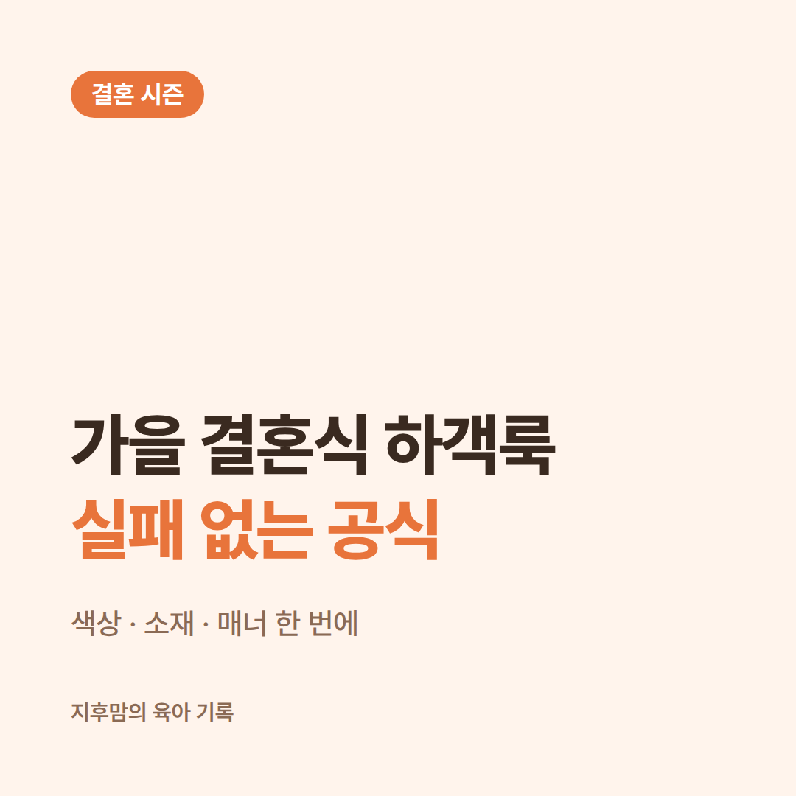
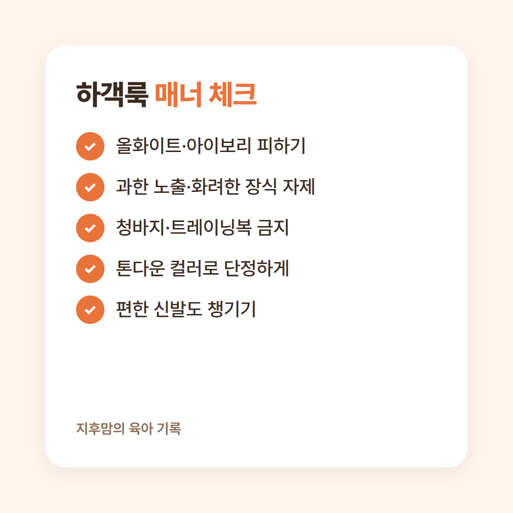
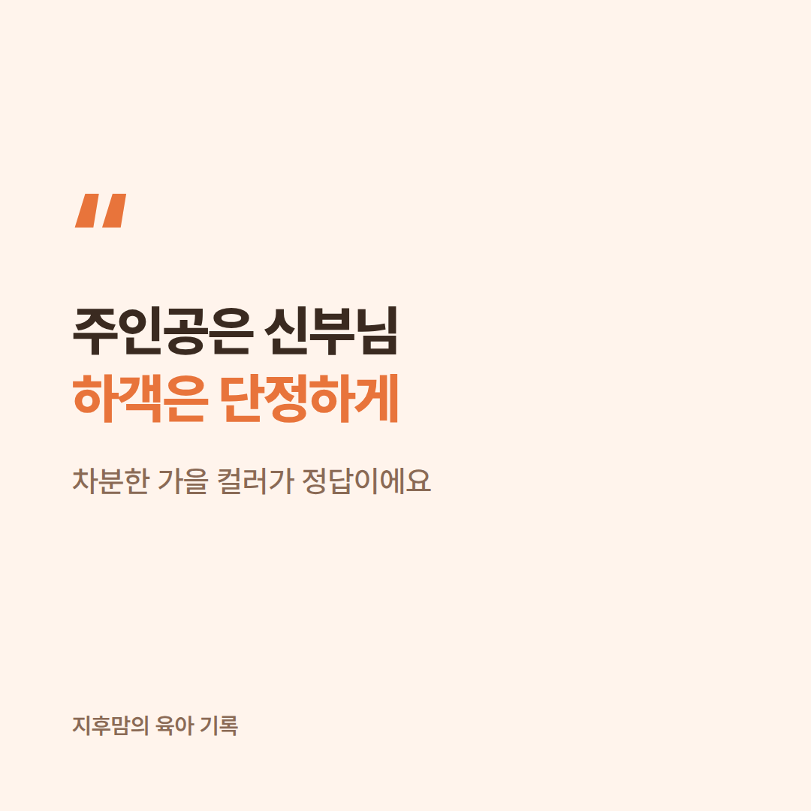

가을은 결혼식이 몰리는 시즌이라, 주말마다 청첩장을 받게 되죠.
막상 가려고 하면 "뭘 입고 가지?" 하는 고민이 꼭 생겨요.
그래서 **가을 결혼식 하객룩**을 색상·소재·매너 기준으로 정리했어요.

<!-- ✍️ 직접 쓰기: 하객룩 때문에 고민했던 경험 혹은 결혼식에서 본 인상 깊은 하객 차림 -->

## 가을 하객룩 컬러

가을에는 샌드 베이지·딥 네이비·브라운 같은 **차분한 베이스 컬러**가 무난해요.
여기에 버건디나 올리브 그린으로 포인트를 주면 단정하면서도 계절감이 살아요.
검정, 네이비, 톤다운된 핑크·보라 계열 원피스도 실패가 적어요.

## 이것만은 피하세요

- **올화이트·아이보리 등 흰색 계열**: 신부와 겹칠 수 있어서 피하는 게 기본 매너예요. 밝은 베이지도 사진에서 하얗게 보일 수 있어요.
- **지나치게 화려한 원색·장식**: 주인공보다 튀지 않게요.
- **과한 노출**, 무릎 위로 올라오는 짧은 기장
- **청바지·트레이닝복·슬리퍼** 같은 너무 편한 차림

## 소재와 아이템 팁

- 일교차가 크니 **가디건·재킷·숄** 같은 얇은 겉옷을 챙겨요. 예식장은 실내가 덥다가 야외에서 쌀쌀할 수 있어요.
- 니트 원피스나 트위드 재킷은 가을 분위기가 나면서 단정해 보여요.
- 오래 서 있을 수 있으니 굽은 편한 걸로, 여분 신발이 있으면 좋아요.
- 옷 한 벌을 재킷·이너만 바꿔 **돌려 입기** 하면 부담이 줄어요.

## 아이 동반 하객이라면

- 아이 옷도 톤다운 컬러로 단정하게, 흰 옷은 피하는 게 좋아요.
- 여벌옷, 간식, 조용한 장난감을 챙기면 식 내내 든든해요.

## 핵심 요약 3줄
1. 베이지·네이비·브라운 등 차분한 가을 컬러로.
2. 흰색 계열과 과한 노출·화려함은 피하기.
3. 겉옷과 편한 신발까지 챙기기.

<!-- ✍️ 직접 쓰기: 내가 자주 입는 하객룩 조합 -->

올가을 결혼식 일정 있으세요? 어떤 하객룩으로 가실지 댓글로 알려주세요 😊
